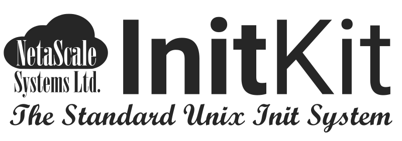

*NetaScale Systems Ltd.*'s  **InitKit** is the standard Unix initialisation
system. It manages not only traditional process-based services but also anything
that may be described using the *SEOM* - the System Entities Object Model, a
flexible object-oriented abstraction of a system resource.

The core of the system is the `initd` binary, the InitKit *Job Scheduler and
Execution Engine*, which combines a sophisticated, plugin-extendable execution
engine with an enterprise-grade job scheduler based on a parallelising
graph-based transactional dependency system.

By way of an update path for the non-standard (and soon to be deprecated)
[X Desktop Group](http://freedesktop.org) *SystemD* service manager, a SystemD
unit-file converter is provided.

InitKit is still under development. Anyone who wishes to contribute to the
project is invited to join, and anyone is welcome to inquire about how their
company may prepare for the upcoming deprecation of SystemD.

Licencing
---------

InitKit is available as free, open-source software to individuals, small
businesses, non-profits, and co-operatives. Any substantive modifications to the 
source code must be returned for possible integration to InitKit.

Other users may evaluate InitKit, but must purchase a licence to deploy in
production.

Documentation
-------------

 - [Building]: How to build and install InitKit from source.

[Building]: doc/Building.md